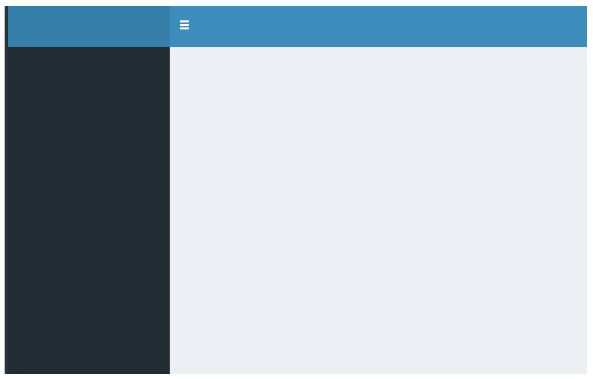
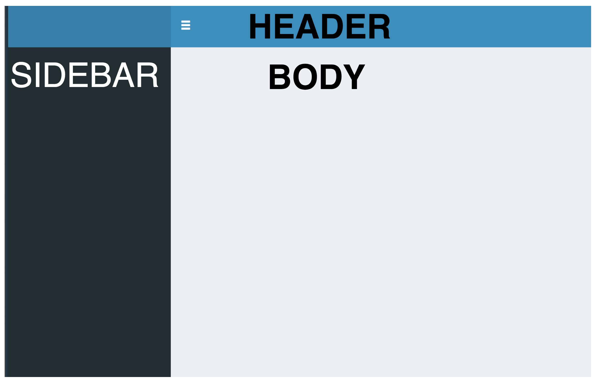
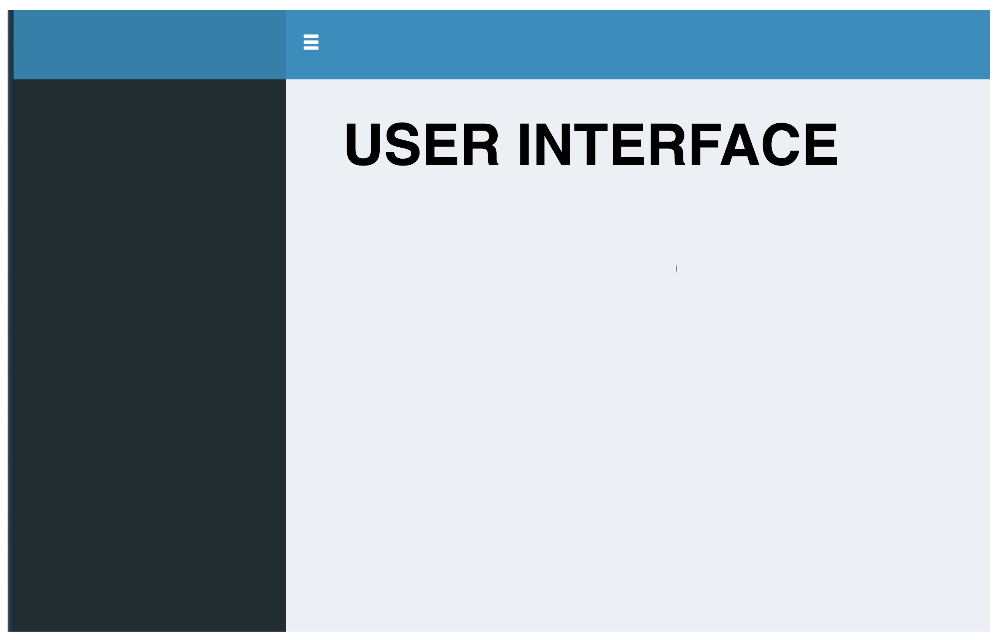
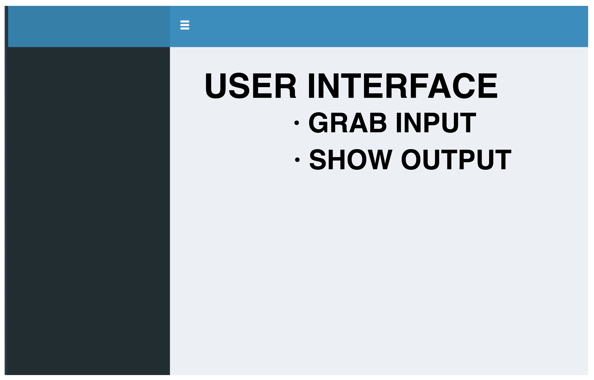
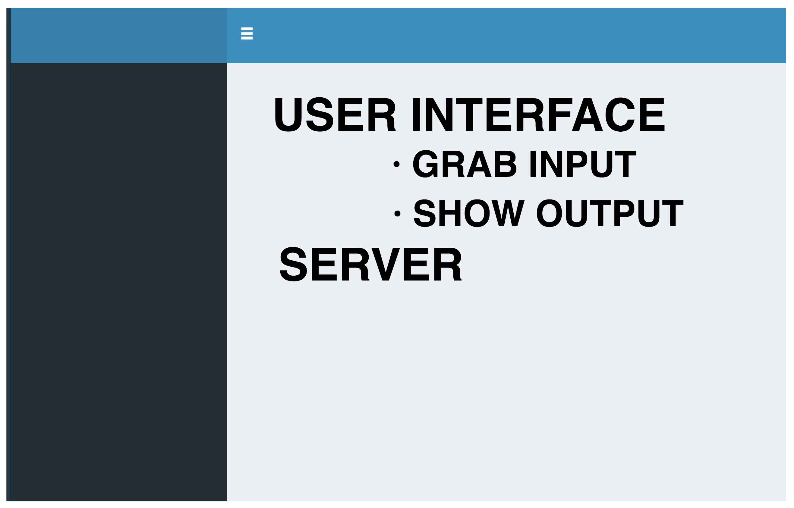
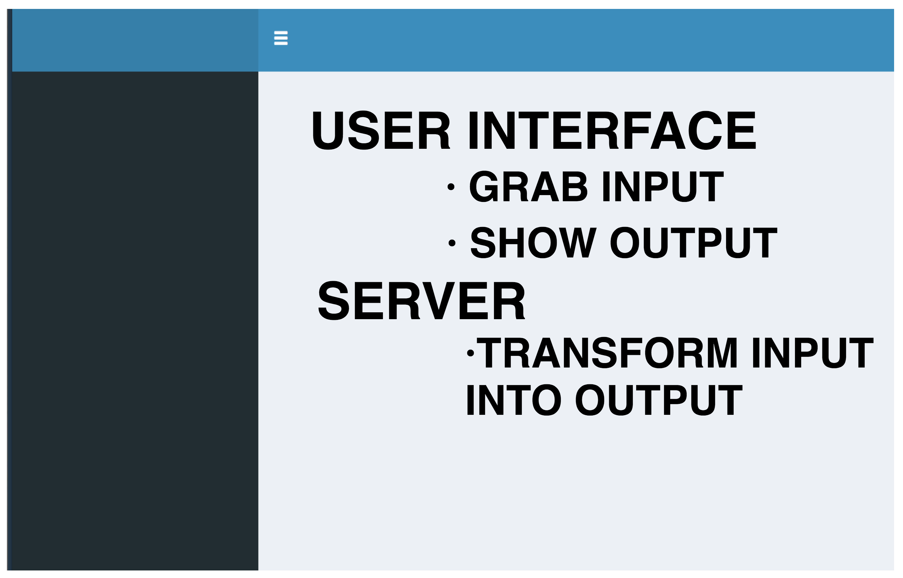
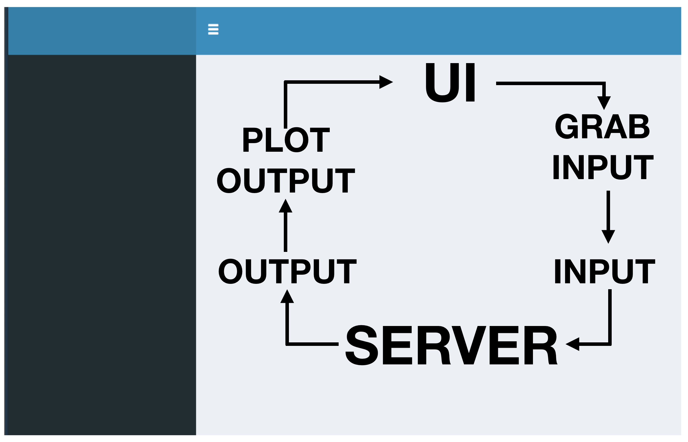

```{r dependencies, message=FALSE, warning=FALSE, include=FALSE, paged.print=FALSE}
packages <- c('ggplot2','leaflet','plotly','ggridges','dygraphs',
              'viridis','shiny','knitr','data.table','shinydashboard',
              'tidyquant')
invisible(sapply(packages, function(x) library(x,character.only = T,quietly = T,verbose = F,warn.conflicts = F))) 


options(httr_oauth_cache = TRUE) # enable using a local file to cache OAuth access credentials between R sessions
twitteR::setup_twitter_oauth(consumer_key = "d3vPYQn5mvfId1yODxj64LT4w",  
                             consumer_secret = "QAJi3ZrPcdA6jKJZ56M9HZPSR17tIjU57goSRGlgyr1zuKxs3O", 
                             access_token = "995001036392845313-Es0hdJ5ZUIlRaSaG28jv4478aykhMcv", 
                             access_secret = "8kmVZYr86YHRCsiF0qeX37CjvBfOrbjjQ5XEQSNhuI9dG")
```

# WHAT IS A SHINYDASHBOARD

## WHAT IS A SHINYDASHBOARD
One of the beautiful gifts that R has got (that Python misses) is the package – Shiny. Shiny is an R package that makes it easy to build interactive web apps straight from R. Making Dashboard is an imminent wherever Data is available since Dashboards are good in helping Business make insights out of the existing data.

Every shiny application has two main sections 1. ui and 2. server. ui is where the code for front-end like buttons, plot visuals, tabs and so on are present and server is where the code for back-end like Data Retrieval, Manipulation, Wrangling are present.


Instead of simply using only shiny, Here we will couple it with shinydashboard. shinydashboard is an R package whose job is to make it easier (as the name suggests) to build dashboards with shiny. The ui part of a shiny app built with shinydashboard would have 3 basic elements wrapped in dashboardPage().

* dashboardPage()
    + dashboardHeader()
    + dashboardSidebar()
    + dashboardBody()

## EXAMPLES
* **GLOBAL TERRORISM** Detailed analysis of global terrorism by types and location, including predictive features.
    + [APP](https://sarthakdasadia.shinyapps.io/GlobalTerrorism/)
    + [SOURCE CODE](https://github.com/sdasadia/Global-Terrorism-Database)
    
    
* **TIME SERIES DASHBOARD** Time series forecasting methods utilizing ggplot2, forecast and Plotly.
    + [APP](https://raviolli77.shinyapps.io/forecast_dashboard/)
    + [SOURCE CODE](https://github.com/inertia7/timeSeries_sp500_R)
    
    
* **MACHLEARN** A machine learning dashboard. Use to train, tune and compare ML algorithms.
    + [APP](https://davesteps.shinyapps.io/machLearn/)
    + [SOURCE CODE](https://github.com/davesteps/machLearn)

# STRUCTURE
## STRUCTURE
```{r structure_1, echo=FALSE, fig.cap="A caption", out.width = '100%'}

```

## STRUCTURE
```{r structure_2, echo=FALSE, fig.cap="A caption", out.width = '100%'}

```

## STRUCTURE
```{r structure_3, echo=FALSE, fig.cap="A caption", out.width = '100%'}

```

## STRUCTURE
```{r structure_4, echo=FALSE, fig.cap="A caption", out.width = '100%'}

```

## STRUCTURE
```{r structure_5, echo=FALSE, fig.cap="A caption", out.width = '100%'}

```

## STRUCTURE
```{r structure_6, echo=FALSE, fig.cap="A caption", out.width = '100%'}

```

# UNDER THE HOOD
## UNDER THE HOOD
```{r uth_1, echo=FALSE, fig.cap="A caption", out.width = '100%'}

```

## UNDER THE HOOD
###  Header, sidebar and body of a shinydashboard
```{r uth_2, echo=TRUE,comment='##'}
# let's create an empty header, an empty sidebar and an empty body
header <- dashboardHeader()
sidebar <- dashboardSidebar()
body <- dashboardBody()
```

## UNDER THE HOOD
###  User interface and Server Function
```{r uth_3, echo=TRUE,comment='##'}
# Create the UI using the header, sidebar, and body
ui <- dashboardPage(header,sidebar,body)
# Create a server function that do nothing
server <- function(input, output) {}
```

## UNDER THE HOOD
###  Render an empty shinydashboard
```{r uth_4, echo=TRUE,comment='##'}
shinyApp(ui, server)
```

# HEADER
## HEADER
* **DROPDOWN MENUS** 
    + MESSAGES
    + NOTIFICATIONS
    + TAKS

## HEADER
###  MESSAGE MENU
```{r h1, echo=TRUE,comment='##'}
header <- dashboardHeader(dropdownMenu(type = 'messages'))
```

```{r h1b, echo=FALSE, message=FALSE, warning=FALSE, comment='##', paged.print=FALSE}
ui <- dashboardPage(header,sidebar,body)
shinyApp(ui, server)
```

## HEADER
###  ADD A MESSAGE
```{r h2, echo=TRUE,comment='##'}
header <- dashboardHeader(
  dropdownMenu(type = 'messages', 
               messageItem(
                 from = 'ie', icon = shiny::icon('university'),message = 'keep studying')
               ))
```

```{r h2b, echo=FALSE, message=FALSE, warning=FALSE, comment='##', paged.print=FALSE}
ui <- dashboardPage(header,sidebar,body)
shinyApp(ui, server)
```

## HEADER
###  NOTIFICATIONS  MENU
```{r h3, echo=TRUE,comment='##'}
header <- dashboardHeader(dropdownMenu(type = 'messages'),dropdownMenu(type='notifications'))
```

```{r h3b, echo=FALSE, message=FALSE, warning=FALSE, comment='##', paged.print=FALSE}
ui <- dashboardPage(header,sidebar,body)
shinyApp(ui, server)
```

## HEADER
###  ADD A NOTIFICATION
```{r h4, echo=TRUE,comment='##'}
header <- dashboardHeader(
  dropdownMenu(type = 'messages') ,
  dropdownMenu(type = 'notifications',
               notificationItem(
                 text = '100 new users today', icon = shiny::icon('thumbs-up'),status = "success" )))
```

```{r h4b, echo=FALSE, message=FALSE, warning=FALSE, comment='##', paged.print=FALSE}
ui <- dashboardPage(header,sidebar,body)
shinyApp(ui, server)
```


## HEADER
###  TASK  MENU
```{r h5, echo=TRUE,comment='##'}
header <- dashboardHeader(dropdownMenu(type = 'messages'),dropdownMenu(type = 'notifications'),dropdownMenu(type = 'task'))
```

```{r h5b, echo=FALSE, message=FALSE, warning=FALSE, comment='##', paged.print=FALSE}
ui <- dashboardPage(header,sidebar,body)
shinyApp(ui, server)
```

## HEADER
###  ADD A TASK
```{r h6, echo=TRUE,comment='##'}
header <- dashboardHeader(
  dropdownMenu(type = 'messages') ,
  dropdownMenu(type = 'notifications'),
  dropdownMenu(type = 'tasks',
               taskItem(text = 'check emails',value = 25, color = 'orange')))
```

```{r h6b, echo=FALSE, message=FALSE, warning=FALSE, comment='##', paged.print=FALSE}
ui <- dashboardPage(header,sidebar,body)
shinyApp(ui, server)
```

## HEADER
###  ADD A TITLE TO THE SHINYDASHBOARD
```{r h7, echo=TRUE,comment='##'}
header <- dashboardHeader(title = 'ShinyDashboard')
```

```{r h7b, echo=FALSE, message=FALSE, warning=FALSE, comment='##', paged.print=FALSE}
ui <- dashboardPage(header,sidebar,body)
shinyApp(ui, server)
```

# SIDEBAR AND BODY
## SIDEBAR AND BODY
###  SIDEBAR
Let's add a menu in the sidebar
```{r sb1, echo=TRUE,comment='##'}
sidebar <- shinydashboard::dashboardSidebar(
  sidebarMenu(
    menuItem(text = 'CEO Dashboard', tabName = 'ceo')
  )
)
```

```{r sb1b, echo=FALSE, message=FALSE, warning=FALSE, comment='##', paged.print=FALSE}
ui <- dashboardPage(header,sidebar,body)
shinyApp(ui, server)
```
    
  
## SIDEBAR AND BODY
###  SIDEBAR
Let's add a another one
```{r sb2, echo=TRUE,comment='##'}
sidebar <- shinydashboard::dashboardSidebar(
  sidebarMenu(
    menuItem(text = 'CEO Dashboard ', tabName = 'ceo'),
    menuItem(text = 'CFO Dashboard', tabName = 'cfo')
  )
)
```

```{r sb2b, echo=FALSE, message=FALSE, warning=FALSE, comment='##', paged.print=FALSE}
ui <- dashboardPage(header,sidebar,body)
shinyApp(ui, server)
```

## SIDEBAR AND BODY
###  BODY
Create two tabs with the same tabName from the previous sidebarMenus ('statter','density')
```{r sb3, echo=TRUE,comment='##'}
body <- dashboardBody(
  tabItems(
    tabItem(tabName = 'ceo'),
    tabItem(tabName = 'cfo')
  )
)
```

```{r sb3b, echo=FALSE, message=FALSE, warning=FALSE, comment='##', paged.print=FALSE}
ui <- dashboardPage(header,sidebar,body)
shinyApp(ui, server)
```

## SIDEBAR AND BODY
###  BODY
Let's add some text to identify the tab
```{r sb4, echo=TRUE,comment='##'}
body <- dashboardBody(
  tabItems(
    tabItem(tabName = 'ceo',h1('CEO Dashboard Tab')),
    tabItem(tabName = 'cfo',h1('CFO Dashboard Tab'))
  )
)
```

```{r sb4b, echo=FALSE, message=FALSE, warning=FALSE, comment='##', paged.print=FALSE}
ui <- dashboardPage(header,sidebar,body)
shinyApp(ui, server)
```

## SIDEBAR AND BODY
###  BODY
Create a tabBox for the CFO
```{r sb5, echo=TRUE,comment='##'}
body <- dashboardBody(
  tabItems(
    tabItem(tabName = 'ceo',h1('CEO Dashboard Tab')),
    tabItem(tabName = 'cfo',
            tabBox(title = 'CFO Graphs',
                   tabPanel(title = 'KPIS', icon = icon('signal')), 
                   tabPanel(title = 'Cash Flow', icon = icon('money'))))))
```

```{r sb5b, echo=FALSE, message=FALSE, warning=FALSE, comment='##', paged.print=FALSE}
ui <- dashboardPage(header,sidebar,body)
shinyApp(ui, server)
```


    
# REACTIVE EXPRESSIONS
## REACTIVE EXPRESSIONS
>- Shiny apps wow your users by running fast, instantly fast. But what if your app needs to do a lot of slow computation?

>- Reactive expressions let you control which parts of your app update when, which prevents unnecessary computation that can slow down your app.

>- Reactive expressions are like a function with no arguments. The argument will be list of values called input

>- The input list will be filled by the user in the User Interface

>- The server function will transfrom the input list into the output list of objects

>- The output list of object will be rendered again in the User Interface. 

## UI INPUTS (WAYS TO GRAB INPUT)
FUCNTION | DESCRIPTION
------------- | -------------
[actionButton](https://shiny.rstudio.com/reference/shiny/1.0.5/actionButton.html) | Action button/link
[checkboxGroupInput](https://shiny.rstudio.com/reference/shiny/1.0.5/checkboxGroupInput.html) | Checkbox Group Input Control
[checkboxInput](https://shiny.rstudio.com/reference/shiny/1.0.5/checkboxInput.html) | Checkbox Input Control
[dateInput](https://shiny.rstudio.com/reference/shiny/1.0.5/dateInput.html) | Create date input
[dateRangeInput](https://shiny.rstudio.com/reference/shiny/1.0.5/dateRangeInput.html) | Create date range input
[fileInput](https://shiny.rstudio.com/reference/shiny/1.0.5/fileInput.html) | File Upload Control
[numericInput](https://shiny.rstudio.com/reference/shiny/1.0.5/numericInput.html) | Create a numeric input control

## UI INPUTS (WAYS TO GRAB INPUT)
FUCNTION | DESCRIPTION
------------- | -------------
[radioButtons](https://shiny.rstudio.com/reference/shiny/1.0.5/radioButtons.html) | Create radio buttons
[selectInput](https://shiny.rstudio.com/reference/shiny/1.0.5/selectInput.html) | Create a select list input control
[sliderInput](https://shiny.rstudio.com/reference/shiny/1.0.5/sliderInput.html) | Slider Input Widget
[submitButton](https://shiny.rstudio.com/reference/shiny/1.0.5/submitButton.html) | Create a submit button
[textInput](https://shiny.rstudio.com/reference/shiny/1.0.5/textInput.html) | Create a text input control
[textAreaInput](https://shiny.rstudio.com/reference/shiny/1.0.5/textAreaInput.html) | Create a textarea input control
[passwordInput](https://shiny.rstudio.com/reference/shiny/1.0.5/passwordInput.html) | Create a password input control

## RENDERING FUNCTIONS (WAYS TO TRANSFORM INPUT INTO OUTPUT)
FUCNTION | DESCRIPTION
------------- | -------------
[renderPlot](https://shiny.rstudio.com/reference/shiny/1.0.5/renderPlots.html) | Plot Output
[renderText](https://shiny.rstudio.com/reference/shiny/1.0.5/renderText.html) | Text Output
[renderPrint](https://shiny.rstudio.com/reference/shiny/1.0.5/renderPrint.html) | Printable Output
[renderImage](https://shiny.rstudio.com/reference/shiny/1.0.5/renderImage.html) | Image file output
[renderDataTable](https://shiny.rstudio.com/reference/shiny/1.0.5/renderDataTable.html) | Table output with the JavaScript library DataTables
[renderTable](https://shiny.rstudio.com/reference/shiny/1.0.5/renderTable.html) | Table Output
[downloadHandler](https://shiny.rstudio.com/reference/shiny/1.0.5/downloadHandler.html) | File Downloads


## OUTPUT FUNCTIONS (WAYS TO SHOW OPUTPUT)
FUCNTION | DESCRIPTION
------------- | -------------
[htmlOutput](https://shiny.rstudio.com/reference/shiny/1.0.5/htmlOutput.html) | Create an HTML output element
[plotOutput](https://shiny.rstudio.com/reference/shiny/1.0.5/plotOutput.html) | Create an plot or image output element
[tableOutput](https://shiny.rstudio.com/reference/shiny/1.0.5/tableOutputt.html) | Create a table output element
[dataTableOutput](https://shiny.rstudio.com/reference/shiny/1.0.5/tableOutput.html) | Create a table output element
[textOutput](https://shiny.rstudio.com/reference/shiny/1.0.5/textOutput.html) | Create a text output element
[verbatimTextOutput](https://shiny.rstudio.com/reference/shiny/1.0.5/verbatimTextOutput.html) | Create a verbatim text output element (more options than text)
[downloadButton](https://shiny.rstudio.com/reference/shiny/1.0.5/downloadButton.html) | Create a download button or link


## SPECIAL RENDERING AND OUPUT FUNCTIONS
FUCNTION | DESCRIPTION
------------- | -------------
[renderPlotly](https://www.rdocumentation.org/packages/plotly/versions/4.7.1/topics/plotly-shiny) | Render function for using plotly (interactive ggplot) within Shiny 
[plotlyOutput](https://www.rdocumentation.org/packages/plotly/versions/4.7.1/topics/plotly-shiny) | Output function for using plotly (interactive ggplot) within Shiny 
[renderDygraph](https://rstudio.github.io/dygraphs/shiny.html) | Render function for using dygraph (dynamic time series) within Shiny 
[dygraphOutput](https://rstudio.github.io/dygraphs/shiny.html) | Output function for using dygraph (dynamic time series) within Shiny 
[renderLeaflet](https://rstudio.github.io/leaflet/shiny.html) | Render function for using leaflet (interactive maps) within Shiny 
[leafletOutput](https://rstudio.github.io/leaflet/shiny.html) | Output function for using leaflet (interactive maps) within Shiny 


## RENDER - OUTPUT FUNCTIONS
RENDER | OUTPUT
------------- | -------------
[renderPlot](https://shiny.rstudio.com/reference/shiny/1.0.5/renderPlots.html) | [plotOutput](https://shiny.rstudio.com/reference/shiny/1.0.5/plotOutput.html)
[renderText](https://shiny.rstudio.com/reference/shiny/1.0.5/renderText.html) | [textOutput](https://shiny.rstudio.com/reference/shiny/1.0.5/textOutput.html), [verbatimTextOutput](https://shiny.rstudio.com/reference/shiny/1.0.5/verbatimTextOutput.html)
[renderTable](https://shiny.rstudio.com/reference/shiny/1.0.5/renderTable.html) | [tableOutput](https://shiny.rstudio.com/reference/shiny/1.0.5/tableOutputt.html)
[renderDataTable](https://shiny.rstudio.com/reference/shiny/1.0.5/renderDataTable.html) | [dataTableOutput](https://shiny.rstudio.com/reference/shiny/1.0.5/tableOutput.html)
[renderImage](https://shiny.rstudio.com/reference/shiny/1.0.5/renderImage.html) | [htmlOutput](https://shiny.rstudio.com/reference/shiny/1.0.5/htmlOutput.html)
[downloadHandler](https://shiny.rstudio.com/reference/shiny/1.0.5/downloadHandler.html) | [downloadButton](https://shiny.rstudio.com/reference/shiny/1.0.5/downloadButton.html) 
[renderPlotly](https://www.rdocumentation.org/packages/plotly/versions/4.7.1/topics/plotly-shiny) | [plotlyOutput](https://www.rdocumentation.org/packages/plotly/versions/4.7.1/topics/plotly-shiny)
[renderDygraph](https://rstudio.github.io/dygraphs/shiny.html)| [dygraphOutput](https://rstudio.github.io/dygraphs/shiny.html)
[renderLeaflet](https://rstudio.github.io/leaflet/shiny.html) |[leafletOutput](https://rstudio.github.io/leaflet/shiny.html)

## INPUT - OUTPUT : TextInput and renderText
### textInput
[textInput](https://shiny.rstudio.com/reference/shiny/1.0.5/textInput.html)
Create an input control for entry of unstructured text values

### renderText
[renderText](https://shiny.rstudio.com/reference/shiny/1.0.5/renderText.html)
Makes a reactive version of the given function that also uses cat to turn its result into a single-element character vector.

## INPUT - OUTPUT : Text
### The last tweet using a certain hashtag
```{r io_text, echo=TRUE,comment='##'}
# take a hashtag
textInput(inputId = 'id_hashtag', 
          label = 'Hashtag', 
          value = '#rstudio',
          placeholder = 'Write a Hashtag')
# return the last tweet
renderText({ 
  last_tweet <- twitteR::searchTwitter(input$id_hashtag,n = 1)[[1]]
  return(last_tweet$text)
  })
```


## INPUT - OUTPUT : Table
### fileInput
[fileInput](https://shiny.rstudio.com/reference/shiny/1.0.5/fileInput.html)
Create a file upload control that can be used to upload one or more files.

### renderTable
[renderTable](https://shiny.rstudio.com/reference/shiny/1.0.5/renderTable.html)
Creates a reactive table that is suitable for assigning to an output slot.

## INPUT - OUTPUT : Table
### Visualize the first four rows of an uploaded csv

```{r io_table, echo=TRUE,comment='##'}
# take a hashtag
fileInput(inputId = 'id_file', label = 'CSV File',multiple = F, accept = '.csv')
# return the last tweet
renderTable({
  if(!is.null(input$id_file)){
    datapath <- input$id_file$datapath
    head(fread(datapath),4)
  }}, hover = T)
```

## INPUT - OUTPUT : Numeric & Plot
### numericInput
[numericInput](https://shiny.rstudio.com/reference/shiny/1.0.5/numericInput.html)
Create an input control for entry of numeric values

### renderPlot
[renderPlot](https://shiny.rstudio.com/reference/shiny/1.0.5/renderPlot.html)
Renders a reactive plot that is suitable for assigning to an output slot.

## INPUT - OUTPUT : Numeric & Plot
### Plot normal distribution given the number of observations

```{r io_numeric, echo=TRUE,comment='##'}
numericInput(inputId = 'id_n',label = 'Number of Observations',value = 1000)
renderPlot(width = 500,height = 250,bg = 'transparent', 
           expr = {rnorm(input$id_n) %>% as.data.frame() %>% 
               ggplot(aes(.)) +geom_density(fill='black') + theme_void() })
```

## INPUT - OUTPUT : Select
### selectInput
[selectInput](https://shiny.rstudio.com/reference/shiny/1.0.5/selectInput.html)
Create an input control for entry of numeric values

## INPUT - OUTPUT : Select
### Select the geom to plot a scatter plot

```{r io_select, echo=TRUE,comment='##'}
selectInput(inputId = 'id_geom',label = 'Geom',selected = 'geom_point',selectize = F,
            choices = c('geom_point','geom_jitter','geom_hex','geom_bin2d'))

renderPlot(width = 500,height = 230,bg = 'transparent',
           expr = {geom_ <- eval(parse(text= paste0(input$id_geom,'()'))) 
           ggplot(mpg, aes(cty, hwy)) + geom_ + theme_minimal()  + theme(legend.position = 'none') })
```


## INPUT - OUTPUT : Slider
### sliderInput
[sliderInput](https://shiny.rstudio.com/reference/shiny/1.0.5/sliderInput.html)
Constructs a slider widget to select a numeric value from a range.

## INPUT - OUTPUT : Slider
### Change the smoothness parameter (span) of a geom_smooth

```{r io_slider, echo=TRUE,comment='##'}
sliderInput(inputId = 'id_noise', label = 'Noise', min =0, max = 1, step = 0.1, animate = T,value = 0 )
renderPlot(width = 500,height = 200,bg = 'transparent', expr = { set.seed(0); ggplot(mpg, aes(cty, hwy)) + geom_jitter(alhpa = 0.3,width = input$id_noise,height = input$id_noise)  + theme_minimal()  + theme(legend.position = 'none') + coord_cartesian(ylim = c(10,45),xlim =c(5,35))})
```

## INPUT - OUTPUT : CheckBox
### checkboxInput
[checkboxInput](https://shiny.rstudio.com/reference/shiny/1.0.5/checkboxInput.html)
Create a checkbox that can be used to specify logical values.

### checkboxGroupInput
[checkboxGroupInput](https://shiny.rstudio.com/reference/shiny/1.0.5/checkboxGroupInput.html)
Create a group of checkboxes that can be used to toggle multiple choices independently. The server will receive the input as a character vector of the selected values.


## INPUT - OUTPUT : CheckBox
### Add geoms to a scatter plot

```{r io_checkbox, echo=TRUE,comment='##'}
checkboxGroupInput(inputId = 'id_checkbox',label = 'Geoms',choices = c('geom_smooth','geom_jitter'),selected = NULL)
renderPlot(width = 500,height = 200,bg = 'transparent', expr = { set.seed(0); geoms <-paste0('+',paste0(input$id_checkbox,'()',collapse='+'));ggplot <- paste0('ggplot(mpg, aes(cty, hwy)) + theme_minimal()',ifelse(is.null(input$id_checkbox),'',geoms));eval(parse(text=ggplot))+ coord_cartesian(ylim = c(10,45),xlim =c(5,35)) })
```


## INPUT - OUTPUT : Date Input and Value Box
### dateRangeInput
[dateRangeInput](https://shiny.rstudio.com/reference/shiny/1.0.5/dateRangeInput.html)
Creates a pair of text inputs which, when clicked on, bring up calendars that the user can click on to select dates.

### dateInput
[dateInput](https://shiny.rstudio.com/reference/shiny/1.0.5/dateInput.html)
Creates a text input which, when clicked on, brings up a calendar that the user can click on to select dates.

### valueBox
[valueBox](https://www.rdocumentation.org/packages/shinydashboard/versions/0.7.0/topics/valueBox)
Create a Value Box for the main body of a dashboard


## INPUT - OUTPUT : Date Input and Value Box
### Add geoms to a scatter plot

```{r io_date, echo=TRUE,comment='##'}
dateRangeInput(inputId = 'id_date',label = '',
               start = '2018-01-01',
               end = as.character(as.Date(lubridate::today())),
               startview = 'month')
renderValueBox({valueBox(value = sum(wday(seq.Date(min(as.Date(input$id_date)),max(as.Date(input$id_date)),by = 1))%in%c(7)), 
                         subtitle = 'Number of Sundays'
                         ,icon = icon("calendar"))})
```

# Interactive Visualizations

## Interactive Visualizations

* **Interactive ggplot** 
    + [Plotly](https://plot.ly/ggplot2/)

* **Interactive time series** 
    + [Dygraphs](https://rstudio.github.io/dygraphs/)
    
* **Interactive maps** 
    + [Leaflet](https://rstudio.github.io/leaflet/)

```{r io_diamond_sample, message=FALSE, warning=FALSE, include=FALSE}
set.seed(0)
diamonds_sample <- diamonds[sample(nrow(diamonds),floor(nrow(diamonds)*0.1)),]
diamonds_sample <- as.data.table(diamonds_sample)
diamonds <- as.data.table(diamonds)
```
## Interactive Visualizations : Plotly
```{r io_plotly_1, echo=TRUE,comment='##'}
ggplot(diamonds_sample,aes(carat,price,col=factor(as.integer(carat)))) + 
geom_point() + theme_minimal() + labs(color='Round Carat') -> gg_point
renderPlot({gg_point},width = 750,height = 400,bg = 'transparent')
```

## Interactive Visualizations : Plotly
```{r io_plotly_2, echo=TRUE, message=FALSE, warning=FALSE, comment='##'}
plotly_point <- ggplotly(gg_point,width = 750,height = 400)
renderPlotly({plotly_point})
```

## Interactive Visualizations : Plotly
```{r io_plotly_3, echo=TRUE,comment='##'}
ggplot(diamonds_sample,aes(cut,price,fill=factor(cut))) + geom_violin() + theme_minimal() -> gg_violin
renderPlot({gg_violin},width = 750,height = 400,bg = 'transparent')
```

## Interactive Visualizations : Plotly
```{r io_plotly_4, echo=TRUE, message=FALSE, warning=FALSE, comment='##'}
plotly_violin <- ggplotly(gg_violin,width = 750,height = 400)
renderPlotly({plotly_violin})
```

## Interactive Visualizations : Plotly
```{r io_plotly_5, echo=TRUE,comment='##'}
ggplot(diamonds_sample,aes(x=price,fill=factor(cut))) + geom_density(alpha=0.3) + theme_minimal()-> gg_density
renderPlot({gg_density},width = 750,height = 400,bg = 'transparent')
```

## Interactive Visualizations : Plotly
```{r io_plotly_6, echo=TRUE, message=FALSE, warning=FALSE, comment='##'}
plotly_density <- ggplotly(gg_density,width = 750,height = 400)
renderPlotly({plotly_density})
```

## Interactive Visualizations : Plotly
```{r io_plotly_9, echo=TRUE,comment='##'}
ggplot(diamonds_sample,aes(x=cut,y=color,fill=price,alpha=carat)) + geom_jitter() + theme_minimal()-> gg_jitter
renderPlot({gg_jitter},width = 750,height = 400,bg = 'transparent')
```

## Interactive Visualizations : Plotly
```{r io_plotly_10, echo=TRUE, message=FALSE, warning=FALSE, comment='##'}
plotly_jitter <- ggplotly(gg_jitter,width = 750,height = 400)
renderPlotly({plotly_jitter})
```

## Interactive Visualizations : Dygraphs
```{r io_dygrahph_1, echo=TRUE, message=FALSE, warning=FALSE, comment='##'}
tq_get(c('FB','AAPL')) %>% 
  as.data.table() %>% 
  .[date>=as.Date('2013-01-01'),c('symbol','date','adjusted')] %>% 
  dcast(date~symbol,value.var='adjusted') %>% 
  as.xts.data.table() -> df
renderDataTable({as.data.table(df)})
```

## Interactive Visualizations : Dygraphs
```{r io_dygrahph_2, echo=TRUE, message=FALSE, warning=FALSE, comment='##'}
dyg_1 <- dygraph(df,width = 500,height = 250)
renderDygraph({dyg_1})
```

## Interactive Visualizations : Dygraphs
```{r io_dygrahph_3, echo=TRUE, message=FALSE, warning=FALSE, comment='##'}
dyg_2 <- dygraph(df,width = 500,height = 250) %>% dyRangeSelector()
renderDygraph({dyg_2})
```

## Interactive Visualizations : Dygraphs
```{r io_dygrahph_4, echo=TRUE, message=FALSE, warning=FALSE, comment='##'}
dyg_3 <- dygraph(df,width = 500,height = 250) %>% dyRangeSelector() %>% 
  dyHighlight(highlightCircleSize = 3, 
              highlightSeriesBackgroundAlpha = 0.3,
              highlightSeriesOpts = list(strokeWidth = 3))
renderDygraph({dyg_3})
```

## Interactive Visualizations : Dygraphs
```{r io_dygrahph_5, echo=TRUE, message=FALSE, warning=FALSE, comment='##'}
dyg_4 <- dygraph(df,width = 500,height = 250) %>% dyRangeSelector() %>% 
  dyHighlight(highlightCircleSize = 3, 
              highlightSeriesBackgroundAlpha = 0.3,
              highlightSeriesOpts = list(strokeWidth = 3)) %>% dyRoller(rollPeriod = 5)
renderDygraph({dyg_4})
```

## Interactive Visualizations : Maps
```{r io_map_1, echo=TRUE, message=FALSE, warning=FALSE, comment='##'}
map_1 <- leaflet() %>% addTiles() %>% addMarkers(lat = 40.438065,lng = -3.682697)
renderLeaflet({map_1})
```


## Interactive Visualizations : Maps
```{r io_map_2, echo=TRUE, message=FALSE, warning=FALSE, comment='##'}
map_2 <- leaflet() %>% addTiles() %>% addMarkers(lat = 40.438065,lng = -3.68269,popup = 'IE XL') 
renderLeaflet({map_2})
```


## Interactive Visualizations : Maps
```{r io_map_3, echo=TRUE, message=FALSE, warning=FALSE, comment='##'}
map_3 <- leaflet() %>% addTiles()  %>% addMarkers(lat = 40.438065,lng = -3.682697,label = 'IE XL',labelOptions = labelOptions(interactive = T,textsize = '20px'))
renderLeaflet({map_3}) 
```


## Interactive Visualizations : Maps
```{r io_map_4, echo=TRUE, message=FALSE, warning=FALSE, comment='##'}
map_4 <- leaflet() %>% addTiles()  %>% addMarkers(lat = 40.438065,lng = -3.682697,label = 'IE XL',labelOptions = labelOptions(interactive = T,textsize = '20px'))%>% addProviderTiles(providers$Stamen.Toner)
renderLeaflet({map_4}) 
```


# Exercise
## 1. Create an empty shinydashboard
```{r ex1, echo=TRUE,comment='##'}
header <- dashboardHeader()
sidebar <- dashboardSidebar()
body <- dashboardBody()

server <- function(input,output){}
ui <- dashboardPage(header,sidebar,body)
shinyApp(ui, server)
```

## 2. Add a title and find [here](https://rstudio.github.io/shinydashboard/appearance.html) how to change the skin (choose the skin that you want)
```{r ex2, echo=FALSE, message=FALSE, warning=FALSE, comment='##', paged.print=FALSE}
header <- dashboardHeader(title = 'Shiny Exercises')
sidebar <- dashboardSidebar()
body <- dashboardBody()

server <- function(input,output){}
ui <- dashboardPage(header,sidebar,body,skin = 'black')
shinyApp(ui, server)
```

## 3. Use this chunk to create a list of notifications
```{r ex3, echo=TRUE,comment='##'}
tasks<- dropdownMenu(type = "tasks", badgeStatus = "success",
                    taskItem(value = 85, color = "green",text = "Study ggplot"), 
                    taskItem(value = 30, color = "yellow",text = "Study shinydashboard"),  
                    taskItem(value = 0, color = "red",text = 'Find information about flexdashboard'))
```


```{r ex3b, echo=FALSE, message=FALSE, warning=FALSE, comment='##', paged.print=FALSE}
header <- dashboardHeader(title = 'Shiny Exercises',tasks)
sidebar <- dashboardSidebar()
body <- dashboardBody()

server <- function(input,output){}
ui <- dashboardPage(header,sidebar,body,skin = 'black')
shinyApp(ui, server)
```

## 4. Add some messages
```{r ex4b, echo=FALSE, message=FALSE, warning=FALSE, comment='##', paged.print=FALSE}
messages<- dropdownMenu(type = "messages", badgeStatus = "warning",
                    messageItem(from = 'yourself',message = 'keep studying data viz',icon = icon('bookmark')))

header <- dashboardHeader(title = 'Shiny Exercises',tasks,messages)
sidebar <- dashboardSidebar()
body <- dashboardBody()

server <- function(input,output){}
ui <- dashboardPage(header,sidebar,body,skin = 'black')
shinyApp(ui, server)
```

## 5. Use this chunk add a sidebar menu
```{r ex5, echo=TRUE,comment='##'}
sidebar_menu_ggplot <- sidebarMenu(id = 'ggplot',
                                   menuItem(tabName  = "tab_ggplot", 
                                            text = 'ggplot',
                                            icon = icon("dashboard"),
                                           selectInput(inputId = 'id_geom',
                                                       label = 'Geom',
                                                       selected = 'geom_point',
                                                       selectize = F,
                                                       choices = c('geom_point',
                                                                   'geom_jitter',
                                                                   'geom_hex',
                                                                   'geom_bin2d')
                                                      )
                                           )
                                   )
```

## 5. Use this chunk add a sidebar menu
```{r ex5b, echo=FALSE, message=FALSE, warning=FALSE, comment='##', paged.print=FALSE}
sidebar <- dashboardSidebar(sidebar_menu_ggplot)
ui <- dashboardPage(header,sidebar,body,skin = 'black')
shinyApp(ui, server)
```


## 6. Add an slider input (inputId = 'id_bins') in a new sidebarMenu
```{r ex6, echo=FALSE, message=FALSE, warning=FALSE, comment='##', paged.print=FALSE}
sidebar_menu_histogram <- sidebarMenu(id = 'menu_histogram',
                                   menuItem(tabName  = "tab_histogram", 
                                            text = 'histogram',
                                            icon = icon("signal"),
                                            sliderInput(inputId = 'id_bins', min = 1, max = 100, value = 50,label = 'Bins')
                                           )
                                   )
sidebar <- dashboardSidebar(sidebar_menu_ggplot,sidebar_menu_histogram)
ui <- dashboardPage(header,sidebar,body,skin = 'black')
shinyApp(ui, server)
```

## 7. Add a tab menu using Using this chunk of code. 
```{r ex7, echo=TRUE,comment='##'}
# you won't see any change
tabs <-      tabBox(tabPanel(tabName = 'tab_ggplot', title = 'Ggplot'),
                    tabPanel(tabName = 'tab_histogram', title = 'Histogram'))
body <- dashboardBody(tabs)
```

```{r ex7b, echo=FALSE, message=FALSE, warning=FALSE, comment='##', paged.print=FALSE}
ui <- dashboardPage(header,sidebar,body,skin = 'black')
shinyApp(ui, server)
```

## 8. Reactive function
```{r ex8, echo=TRUE,comment='##'}
scatter_plotter <-  reactive({
  # from string to geom
  geom_ <- eval(parse(text= paste0(input$id_geom,'()'))) 
  # return is not needed (the last evalueted stuff is returned)
  ggplot(mpg, aes(cty, hwy)) + geom_ + theme_minimal()  + 
             theme(legend.position = 'none')
  })
```

## 9.Create a reactive function called hitogram_plotter 
This function will  receive the input$id_bins and return an histogram (made using ggplot) 
where the number of bins is input$id_bins. Use the dataset mpg, the variable cty and the theme_minimal

```{r ex9, echo=FALSE, message=FALSE, warning=FALSE, comment='##', paged.print=FALSE}
histogram_plotter <-  reactive({
  ggplot(mpg, aes(cty)) + geom_histogram(bins = as.numeric(input$id_bins)) + theme_minimal() +
             theme(legend.position = 'none')
  })
```

## 10.Add reactive function in the server function
```{r ex10, echo=TRUE,comment='##'}
server <- function(input,output){
  scatter_plotter <-  reactive({
        # from string to geom
        geom_ <- eval(parse(text= paste0(input$id_geom,'()'))) 
        # return is not needed (the last evalueted stuff is returned)
        ggplot(mpg, aes(cty, hwy)) + geom_ + theme_minimal()  + 
                   theme(legend.position = 'none')
        })
  histogram_plotter <-  reactive({
        ggplot(mpg, aes(cty)) + geom_histogram(bins = as.numeric(input$id_bins)) + theme_minimal() +
                   theme(legend.position = 'none')
        })
}
```

## 11. Make server do somthing
```{r ex11, echo=TRUE,comment='##'}
server <- function(input,output){
  scatter_plotter <-  reactive({
        # from string to geom
        geom_ <- eval(parse(text= paste0(input$id_geom,'()'))) 
        # return is not needed (the last evalueted stuff is returned)
        ggplot(mpg, aes(cty, hwy)) + geom_ + theme_minimal()  + 
                   theme(legend.position = 'none')
        })
  histogram_plotter <-  reactive({
        ggplot(mpg, aes(cty)) + geom_histogram(bins = as.numeric(input$id_bins)) + theme_minimal() +
                   theme(legend.position = 'none')
        })
  
  
  output$ggplot <- renderPlot(scatter_plotter())
}
```

## 12. Add the histogram in output$histogram
```{r ex12, echo=FALSE, message=FALSE, warning=FALSE, comment='##', paged.print=FALSE}
server <- function(input,output){
  scatter_plotter <-  reactive({
        # from string to geom
        geom_ <- eval(parse(text= paste0(input$id_geom,'()'))) 
        # return is not needed (the last evalueted stuff is returned)
        ggplot(mpg, aes(cty, hwy)) + geom_ + theme_minimal()  + 
                   theme(legend.position = 'none')
        })
  histogram_plotter <-  reactive({
        ggplot(mpg, aes(cty)) + geom_histogram(bins = as.numeric(input$id_bins)) + theme_minimal() +
                   theme(legend.position = 'none')
        })
  
  
  output$ggplot <- renderPlot(scatter_plotter())
  output$histogram <- renderPlot(histogram_plotter())
}
```

## 12. Add the histogram in output$histogram
```{r ex12b, echo=TRUE,comment='##'}
server <- function(input,output){
  scatter_plotter <-  reactive({
        # from string to geom
        geom_ <- eval(parse(text= paste0(input$id_geom,'()'))) 
        # return is not needed (the last evalueted stuff is returned)
        ggplot(mpg, aes(cty, hwy)) + geom_ + theme_minimal()  + 
                   theme(legend.position = 'none')
        })
  histogram_plotter <-  reactive({
        ggplot(mpg, aes(cty)) + geom_histogram(bins = as.numeric(input$id_bins)) + theme_minimal() +
                   theme(legend.position = 'none')
        })
  
  
  output$ggplot <- renderPlot(scatter_plotter())
  output$histogram <- renderPlot(histogram_plotter())
}
```

## 13. Run the app
```{r ex13, echo=FALSE, message=FALSE, warning=FALSE, comment='##', paged.print=FALSE}
tabs <-      tabBox(tabPanel(tabName = 'tab_ggplot', title = 'Ggplot', plotOutput('ggplot')),
                    tabPanel(tabName = 'tab_histogram', title = 'Histogram',plotOutput('histogram')))
body <- dashboardBody(tabs)
ui <- dashboardPage(header,sidebar,body,skin = 'black')
shinyApp(ui, server)
```

## 13. Run the app
```{r ex13b, echo=FALSE, comment='##'}
tabs <-      tabBox(width = '100%', height = '100%',
                    tabPanel(tabName = 'tab_ggplot', title = 'Ggplot', plotOutput('ggplot')),
                    tabPanel(tabName = 'tab_histogram', title = 'Histogram',plotOutput('histogram')))
body <- dashboardBody(tabs)
ui <- dashboardPage(header,sidebar,body,skin = 'black')
shinyApp(ui, server)
```

# Study case
## Study case
### **1. Stocks. Use Candlestick Charts instead of Line Chart.**
### find the solutin here [https://rstudio.github.io/dygraphs/index.html](https://rstudio.github.io/dygraphs/index.html)

## Study case
### **2. Stocks. Syncronization beetween both graphs.**
### find the solutin here [https://rstudio.github.io/dygraphs/index.html](https://rstudio.github.io/dygraphs/index.html)

## Study case
### **3. Stocks. Observe events. Using this chung of code make that the name selector and the ticker selector work together.**
### Copy and paste the chunk of code in the right part the code is only half of the task. 
### You need to create and observer to update the name when the ticker changes.
### find the solutin here [http://shiny.rstudio.com/reference/shiny/1.0.2/observeEvent.html](http://shiny.rstudio.com/reference/shiny/1.0.2/observeEvent.html)

## Study case
### **3. Stocks. Observe events. Using this chung of code make that the name selector and the ticker selector work together.**

```{r echo=TRUE, message=FALSE, warning=FALSE, comment='##'}
#################### UPDATE NAME -> TICKER

  observeEvent(eventExpr = input$id_name,
               handlerExpr = {
                 ticker <- symbols[Name == input$id_name,Symbol]
                 updateSliderInput(session = session,
                                                inputId = 'id_ticker',
                                                label = ticker,
                                                value = ticker)})
```


## Study case
### **3. Stocks. Observe events. Using this chung of code make that the name selector and the ticker selector work together.**
### Copy and paste the chunk of code in the right part the code is only half of the task. 
### You need to create and observer to update the name when the ticker changes.
### find the solutin here [http://shiny.rstudio.com/reference/shiny/1.0.2/observeEvent.html](http://shiny.rstudio.com/reference/shiny/1.0.2/observeEvent.html)

## Study case
### **4. Ggplot. Add a selecInput for the alpha aesthetic (and make it work), an sliderInput to select the range of the size aesthetic and also a checkboxInput to decide if visualize the scatter plot with or without jitter.**

## Study case
### **5. Map. Using this chunk of code, add a SideBar Menu fot the map and also a Tab to visualize the map in the body .**

```{r echo=TRUE, message=FALSE, warning=FALSE, comment='##'}
sidebar_map_menu <-   sidebarMenu(id = "sidebar_ggplot_menu",
                                  menuItem(text = "Map", icon = icon("map"),
                                           textInput(inputId = 'id_map_text',
                                                     value = 'Velazquez, 130 Madrid',
                                                     label = 'Location')
                                  )
                              )

body_map_tab <-   tabPanel('Map',
                           leafletOutput('map',width = '100%',height = 700)
                          )
```

